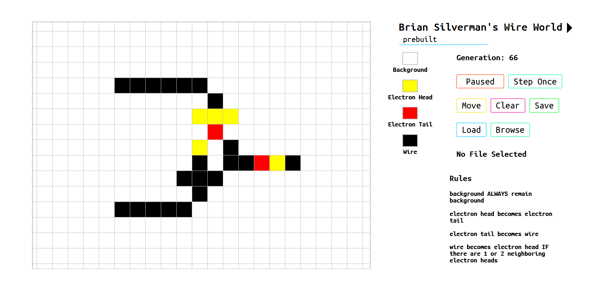

# Cellular Automata JS

A library for working with Cellular Automata in Javascript. Code is extremely modular allowing easy customizations to simulation rules and most aspects of the rendering process. This library is made with pure JavaScript, so no third party code is needed to use this.



# Getting Started

There are more configuration options, but this example will overwrite the default canvas size of 800x700 pixels. Additionally, configuration options left undefined will be automatically filled out with pre-determined default values.

Note, the creation of a `CARender` object will not begin an update loop to step through the simulation nor will it attempt to draw anything.

```
var configs = {
    width: 500,
    height: 500,
};

var render = new CARender(configs)
```

## Updating and Rendering the Simulation
My 2 examples both use the `window.requestAnimationFrame` to drive the update loop

`render.Update` will step the simulation if necessary and will render it according to specified functions in configs with the given drawContext. This allows customized grid displays and even allows alternative rendering mediums.

```
function tick()
{
    render.Update(drawContext, configs);

    if (configs.loopState !== CARender.loopEnum.noLoop)
    {
        window.requestAnimationFrame(tick);
    }
}
```

To encapsulate into an object the `.bind` function will be needed to access the necessary data.

```
tick()
{
    this.render.Update(this.drawContext, this.configs);

    if (this.configs.loopState !== CARender.loopEnum.noLoop)
    {
        window.requestAnimationFrame(this.tick.bind(this));
    }
}
```

## User Input

A UserInput object provides mouse events for interacting with the simulation as well as key board shortcuts. Note, these events will not be attached by default and must be requested or done manually.

```
var userInput = new UserInput(render);      // userInput will now provide access for 
                                            // the user to interact with the given simulation

var attachKeyboardEvents = true;
var attachMouseEvents = true;

userInput.attachEvents(canvas, attachKeyboardEvents, attachMouseEvents)  // this will attach 
                                                                            keyboard and mouse events
```

The two boolean values can be left out for the default values of `attachKeyboardEvents = false` and `attachMouseEvents = false`.

The events can be also be manually attached. For example to implement a custom UI like below

```
<button onClick = "userInput.pauseToggle()" > 
    Pause
</button>
```

# Configurations

These are the default configurations that can be retrieved via `CARender.JSObjectDefault()`

```
var configs = {
    mode: "wire world",
    generation: 0,

    width: 700,
    height: 600,

    x: 0,
    y: 0,

    clr_bg: "#c0c0c0",
    fps: 10,
    fpsStep: 20,
    
    loopState: CARender.loopEnum.stepLoop,
    paused: false,
    drawSpecificState: true,
    drawState: 1,

    zoom: 1,
    maxZoom: 9,
    minZoom: .8,

    DrawCellFunc: (drawContext, coord, cellSize) =>
    {
        drawContext.fillRect(coord.x, coord.y, cellSize-1, cellSize-1);
    },

    DrawStyleFunc: (drawContext, clr) =>
    {
        drawContext.fillStyle = clr;
    },

    PreStepFunc: (drawContext, clr, windowSize) =>
    {
        drawContext.fillStyle = clr;
        drawContext.fillRect(0, 0, windowSize.x, windowSize.y);
    },

    PostStepFunc: (drawContext, clr, windowSize) =>
    {
        drawContext.strokeStyle = clr;
        drawContext.moveTo(1, 1);
        drawContext.lineTo(1, windowSize.y-1);
        drawContext.lineTo(windowSize.x-1, windowSize.y-1);
        drawContext.lineTo(windowSize.x-1, 1);
        drawContext.lineTo(1, 1);
        drawContext.stroke();
    },
};
```

Additionally, a custom set of configs can have any missing attributes automaticall filled out with the default values.

```
var configs = {
    width: 500,
    height: 500,
}

CARender.fillJSObjectBlanks(configs)

// configs will now equal this
// {
//     mode: "wire world",
//     generation: 0,
// 
//     width: 700,
//     height: 600,
// 
//     x: 0,
//     y: 0,
// 
//     clr_bg: "#c0c0c0",
//     fps: 10,
//     fpsStep: 20,
//     
//     loopState: CARender.loopEnum.stepLoop,
//     paused: false,
//     drawSpecificState: true,
//     drawState: 1,
// 
//     zoom: 1,
//     maxZoom: 9,
//     minZoom: .8,
// 
//     DrawCellFunc: (drawContext, coord, cellSize) => { ... },
//     DrawStyleFunc: (drawContext, clr) => { ... },
//     PreStepFunc: (drawContext, clr, windowSize) => { ... },
//     PostStepFunc: (drawContext, clr, windowSize) => { ... },
// }
```

Lastly, `configs` can be passed through `CARender.fillModesInObj(configs)` to fill out other necessary fields if a prebuilt mode is being used. Currently there are only two configurations, Wire World and Game of Life.

They can be used by setting `configs.mode` to `"wire world"` or `"game of life"`

```
var configs = {
    mode: "game of life",
}

CARender.fillModesInObj(configs)

// configs will now equal this
{
    mode: "game of life",

    title: "Conway's Game of Life",
    subtitle: "prebuilt",
    cellColors: {0: 'white', 1: 'black'},
    stateNames: ["Dead", "Alive"],

    rules: [(neighborsValues, curVal) => {
                // gets live neighbor count
                var liveNeighbors = neighborsValues.filter( (val) => { return val === 1; } );
                liveNeighbors = liveNeighbors.length;

                // gets the outcome of the rule
                var result = (curVal === 1 && (liveNeighbors === 2)) || (liveNeighbors === 3);

                // formats the output
                return [result, result ? 1 :  0];
            }],

    ruleDescriptions:   ["(over population) live cells with 4 or more live neighbors 'dies'",
                            "(under population) live cells with less than 2 live neighbors 'dies'",
                            "(birth) dead cells with 3 live neighbors become alive",
                            "live cells with 2 or 3 neighbors remain alive",
                        ],
    
}
```

Note, if `configs.mode` matches any of the prebuilt modes, all of the above attributes will be overwritten.

The following code demonstrates how different attributes of a prebuilt mode can mixed and match. BE CAREFUL. Doing so might result in ERRORS. However this case should work fine. It will only change the colors of the cells being rendered.

```
var configs = {
    title: "custom",
    rules: "game of life",
    cellColors: "wire world,

    ...
}
```

# Custom Rules

Custom rulesets may be passed to CARender through configs.rules in the form of a list of functions. All functions have 2 parameters, `neighborsValues` and `curVal`. Additionally, they must return an array, `result`, of two values. The first is a boolean indicating this rule should change the current cell's state and no further rule evaluations are necessary. The second being an integer that is the current cell's new state. 

`neighborsValues` is a list of 8 integers representing the current cell's neighbors' states.

`curVal` is an integer representing the current cell's state.

`result` is an array of a 2 values, a boolean and an integer. The boolean indicates if the result of this rule should be the current cell's new state and no further simulation is required for this cell. The integer is the state that should be assigned, provided the boolean is true.

The following code is the default rule for Conway's Game of Life

```
function GameOfLifeRule(neighborsValues, curVal)
{
    // gets live neighbor count
    var liveNeighbors = neighborsValues.filter( (val) => { return val === 1; } );
    liveNeighbors = liveNeighbors.length;

    // gets the outcome of the rule
    var result = (curVal === 1 && (liveNeighbors === 2)) || (liveNeighbors === 3);

    // formats the output
    return [result, result ? 1 :  0];
}
```

Keep in mind, if a cell is not affected by any of the given rules in a step of the simulation, it will become the default value, 0.

Additionally, comments on lines 555-588 of CARender.js show the rules for my Wire World.

# Custom Cell Colors

Cell colors can easily be set by changing `configs.cellColors`. Note, colors must be hexidecimal such `"#c0c0c0"` or one of JavaScript's built colors such as `"blue"`

```
configs.cellColors = {
    0: "purple", 
    1: "blue",
}
```

As noted in the Custom Rules section, changes like the one above should be done after `CARender.fillModesInObj` is called if a prebuilt mode is being used. It will be overriden with mode's default value, otherwise.

# Other Custom Rendering Options

At different times of the rendering process `configs.PreStepFunc`, `configs.PostStepFunc`, `configs.DrawStyleFunc`, and `configs.DrawCellFunc` are called.

`configs.PreStepFunc(drawContext, backgroundColor, windowSize)` is first of the 4 called. It is given a drawing context, the background, and the size of the canvas. By default, it will clear the canvas by filling a rectangle of the background color over the whole grid.

`configs.PostStepFunc(drawContext, backgroundColor, windowSize)` is the last of the 4 called and it is given a drawing context, the background color, and the size of the canvas. By default, it will draw a border around the canvas using the background color.

The rendering of the grid itself done so in batches. All cells to be rendered are sorted by their color and groups are rendered in sequential order. So all cells with state 0 will be rendered before any cells of state 1.

`configs.DrawStyleFunc(drawContext, cellColor)` is called before each batch and can be used to set the draw style for the batch. It is passed a draw context and a color. By default, it will set the `drawContext.fillStyle` to the given color.

`configs.DrawCellFunc(drawContext, coord, cellSize)` is called to render each indivual cell. It is passed a draw context, a screen coordinate denoting the top left corner of the cell, and the size of a cell. By default, it will fill a rectangle of given size at the given coordinate. This can easily be replaced to render an image, or any other kind of shape.

Below shows how to draw circular cells instead of squares

```
configs.DrawCellFunc = (drawContext, coord, cellSize) =>
{
    drawContext.beginPath();
    drawContext.arc(coord.x, coord.y, (cellSize-1)/2, 0, 2 * Math.PI);
    drawContext.fill();
}
```

Unfortunately, `drawContext.fill` and `drawContext.beginPath` cannot be done at the beginning and end of a cell batch, so they are for each cell. If you don't mind getting your hands dirty, `CARender.DrawGrid` on line 256 of `CARender.js` can be modified, in this case to optimize the drawing of circles.

The following line can be inserted on line 270 of `CARender.js`
```
drawContext.fill()
```

and the next line of code can be added to `configs.DrawStyleFunc`

```
drawContext.beginPath()
```

# Checking Update State

`checkState(shouldUpdateState)` should be given a boolean to represent if the check should update the fps controller. It will a vaule from the enum shown below.

```
CARender.renderState = {
    step: 0,
    draw: 1,
    nothin: 2,
    noLoop: 3,
}
```

`CARender.renderState.step` means the simulation needs to be stepped and redrawn

`CARender.renderState.draw` means the simulation should not be stepped but it should be redrawn

`CARender.renderState.nothing` means nothing should happen this update, but the loop should continue

`CARender.renderState.noLoop` means nothing should be done and the update loop should end.

# User Input

As previously stated, `attachEvents(canvas, attachKeyboardEvents, attachMouseEvents)` can be used to automatically attach events. The default values of `attachKeyboardEvents` and `attachMouseEvents` being false and true, repspectively.

Additionally, they can be seperatly attached with `attachMouseEvent(canvas)` and/or `attachKeyEvents()`. `UserInput.keybinds` can be modified at any time to adjust the keyboard shortcuts.

```
// the default keybinds and their purpose
this.keybinds = {
        pause: "p",             // pauses simulation
        step: " ",              // steps the simulation once, if it is paused
        grabCanvas: "o",        // toggle left click between grabbing canvas
                                // and drawing cells
        drawSpecificState: "i", // toggles drawing mode between cycling cells
                                // through the possible states and set to a specific
                                // state indicated by configs.drawState
};
```
